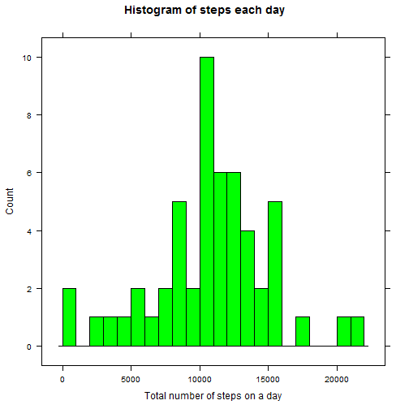
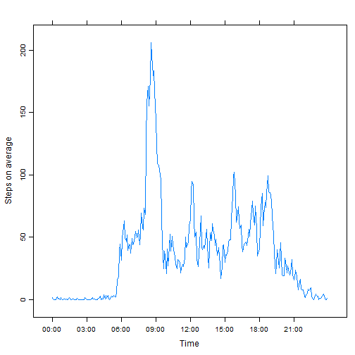
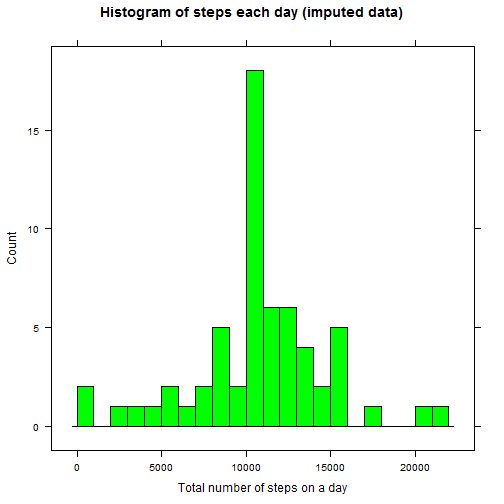
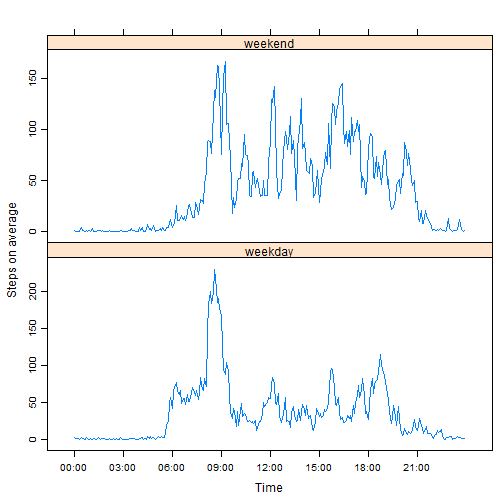

# Reproducible Research: Peer Assessment 1

## Loading and preprocessing the data

Loading libraries

```r
library(lattice)
```
Reading the file into the dataset "ds"


```r
archiveFile <- "activity.zip"
fileNameInArchive <- "activity.csv"

ds <- read.csv(unz(archiveFile, fileNameInArchive))
str(ds)
```

```
## 'data.frame':	17568 obs. of  3 variables:
##  $ steps   : int  NA NA NA NA NA NA NA NA NA NA ...
##  $ date    : Factor w/ 61 levels "2012-10-01","2012-10-02",..: 1 1 1 1 1 1 1 1 1 1 ...
##  $ interval: int  0 5 10 15 20 25 30 35 40 45 ...
```

For the convinience of summarizing by categories saving the subset of "ds" with all the NA values excluded into "dsComplete"


```r
dsNA <- is.na(ds$steps)
dsComplete <- ds[!dsNA, ]
str(dsComplete)
```

```
## 'data.frame':	15264 obs. of  3 variables:
##  $ steps   : int  0 0 0 0 0 0 0 0 0 0 ...
##  $ date    : Factor w/ 61 levels "2012-10-01","2012-10-02",..: 2 2 2 2 2 2 2 2 2 2 ...
##  $ interval: int  0 5 10 15 20 25 30 35 40 45 ...
```

## What is mean total number of steps taken per day?

First count the total number of steps taken each day and look at the histogram of that number. I'm breaking the histogram into 1000 steps intervals.


```r
stepsByDay <- tapply(dsComplete$steps, 
                     factor(dsComplete$date, exclude=ds$date), 
                     sum)
histBreakLength <- 1000
maxSteps <- max(stepsByDay)
nBreaks <- maxSteps %/% histBreakLength + 1
histBreaks <- c(0:nBreaks)*histBreakLength
histogram(stepsByDay, 
     breaks = histBreaks,
     type="count",
     main="Histogram of steps each day", 
     xlab="Total number of steps on a day", 
     col="green")
```

 

The mean and median for the total number of steps taken per day are:


```r
meanForDaily <- mean(stepsByDay)
meanForDaily
```

```
## [1] 10766.19
```

```r
medianForDaily <- median(stepsByDay)
medianForDaily
```

```
## [1] 10765
```

## What is the average daily activity pattern?

First count the average number of steps taken during each time interval.
For a timeseries plot I represent the counted numbers as a timeseries
of 12 values for their respective hours. The labels need to be provided.


```r
stepsByInterval <- tapply(dsComplete$steps,
                          factor(dsComplete$interval),
                          mean)
intervalseries <- ts(unname(stepsByInterval), start=0, frequency=12)
timepoints<-seq(strptime("2015/1/18", "%Y/%m/%d"),length.out=8,by="3 hours")
place <- seq(0, length.out=8, by=3)
xyplot(intervalseries, 
       scales=list(
           x=list(labels=strftime(timepoints, "%H:%M"), at=place)
           ), 
       ylab="Steps on average")
```

 

The maximum average number of steps:


```r
mI <- max(stepsByInterval)
mI
```

```
## [1] 206.1698
```

the interval (or intervals) on which it occurs:


```r
names(stepsByInterval[stepsByInterval==mI])
```

```
## [1] "835"
```

## Imputing missing values

For the missing values I'm inserting the rounded average values of non-missing values for the interval. The new dsImputed dataset has no NA values.


```r
dsImputed <- ds
dsImputed[dsNA, "steps"] <- round(stepsByInterval[
                                    as.character(ds[dsNA, "interval"])])
str(dsImputed)
```

```
## 'data.frame':	17568 obs. of  3 variables:
##  $ steps   : num  2 0 0 0 0 2 1 1 0 1 ...
##  $ date    : Factor w/ 61 levels "2012-10-01","2012-10-02",..: 1 1 1 1 1 1 1 1 1 1 ...
##  $ interval: int  0 5 10 15 20 25 30 35 40 45 ...
```

```r
summary(dsImputed)
```

```
##      steps                date          interval     
##  Min.   :  0.00   2012-10-01:  288   Min.   :   0.0  
##  1st Qu.:  0.00   2012-10-02:  288   1st Qu.: 588.8  
##  Median :  0.00   2012-10-03:  288   Median :1177.5  
##  Mean   : 37.38   2012-10-04:  288   Mean   :1177.5  
##  3rd Qu.: 27.00   2012-10-05:  288   3rd Qu.:1766.2  
##  Max.   :806.00   2012-10-06:  288   Max.   :2355.0  
##                   (Other)   :15840
```

The histogram for new dataset looks different


```r
stepsByDayImputed <- tapply(dsImputed$steps, 
                     factor(dsImputed$date, exclude=ds$date), 
                     sum)
#histBreakLength <- 1000 #was set before, using the same
maxStepsImputed <- max(stepsByDayImputed)
nBreaksImputed <- maxStepsImputed %/% histBreakLength + 1
histBreaksImputed <- c(0:nBreaksImputed)*histBreakLength
histogram(stepsByDayImputed, 
     breaks = histBreaksImputed, 
     type="count",
     main="Histogram of steps each day (imputed data)", 
     xlab="Total number of steps on a day", 
     col="green")
```

 

The mean and median for the total number of steps taken per day with the new dataset are different, too. Calculating the difference to see the impact on estimates  


```r
meanImputed <- mean(stepsByDayImputed)
meanImputed
```

```
## [1] 10765.64
```

```r
meanImputed - meanForDaily
```

```
## [1] -0.549335
```

```r
medianImputed <- median(stepsByDayImputed)
medianImputed
```

```
## [1] 10762
```

```r
medianImputed - medianForDaily
```

```
## [1] -3
```

## Are there differences in activity patterns between weekdays and weekends?

Adding the information on weekends and weekdays to the dataset with filled-in values


```r
dsImputed$datetime <- strptime(
            paste( #concatenate date and parts of time
                  ds[,"date"],
                  sprintf("%02d", ds[,"interval"]%/%100), #105 -> 01, 5 -> 00
                  sprintf("%02d", ds[,"interval"]%%100)), #105 -> 05, 5 -> 05
            "%Y-%m-%d %H %M")
daysToCheck <- weekdays(dsImputed$datetime)
dayType <- ifelse(daysToCheck=="Sunday"|daysToCheck=="Saturday", "weekend", "weekday")
dsImputed$dayType <- factor(dayType, levels=c("weekend", "weekday"))
str(dsImputed)
```

```
## 'data.frame':	17568 obs. of  5 variables:
##  $ steps   : num  2 0 0 0 0 2 1 1 0 1 ...
##  $ date    : Factor w/ 61 levels "2012-10-01","2012-10-02",..: 1 1 1 1 1 1 1 1 1 1 ...
##  $ interval: int  0 5 10 15 20 25 30 35 40 45 ...
##  $ datetime: POSIXlt, format: "2012-10-01 00:00:00" "2012-10-01 00:05:00" ...
##  $ dayType : Factor w/ 2 levels "weekend","weekday": 2 2 2 2 2 2 2 2 2 2 ...
```

Calculating the averages for weekends and weekdays and arranging them into time series, then plotting


```r
stepsByIntervalAndType <- aggregate(steps ~ dayType + interval, data=dsImputed, FUN=mean)
stepsByIntervalForTypes <- xtabs(steps~interval +dayType, stepsByIntervalAndType)
str(stepsByIntervalForTypes)
```

```
##  xtabs [1:288, 1:2] 0.25 0 0 0 0 3.5 0.125 0.125 0 0.5 ...
##  - attr(*, "dimnames")=List of 2
##   ..$ interval: chr [1:288] "0" "5" "10" "15" ...
##   ..$ dayType : chr [1:2] "weekend" "weekday"
##  - attr(*, "class")= chr [1:2] "xtabs" "table"
##  - attr(*, "call")= language xtabs(formula = steps ~ interval + dayType, data = stepsByIntervalAndType)
```

```r
tsx <- ts(stepsByIntervalForTypes, start=0, frequency=12)
xyplot(tsx, 
       scales=list(
            x=list(labels=strftime(timepoints, "%H:%M"), at=place)
           ), 
       ylab="Steps on average")
```

 
